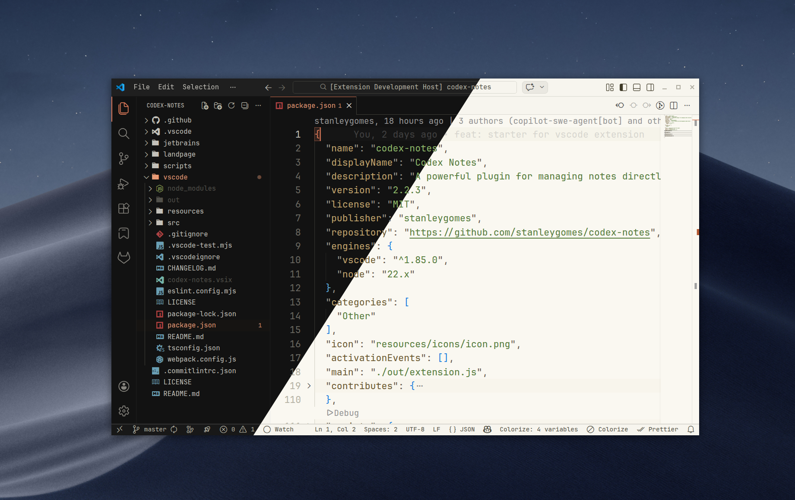
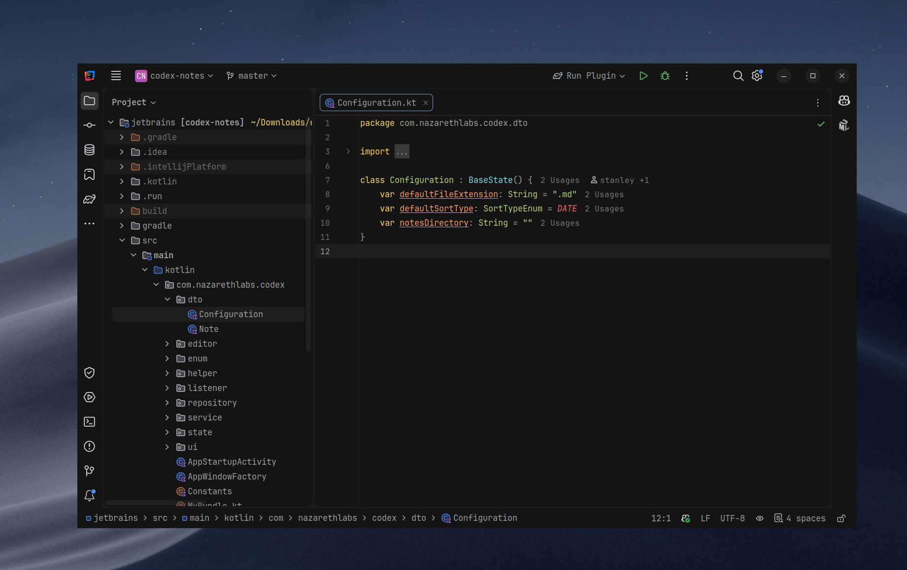

# 🎨 Noemi Theme

<!-- Plugin description -->
The ideal colors and contrast for long hours of coding. Your eyes will thank you.

**Key Features:**
- Optimized color palettes for reduced eye strain 👀
- Full support for all JetBrains IDEs (IntelliJ IDEA, PyCharm, WebStorm, PhpStorm, etc.) 🛠️
- Full support for vscode and it's based IDEs like AntiGravity and Cursor
- Professional and modern design ✨
<!-- Plugin description end -->

## For VS Code



## For Jebrains IDEs



## Installation 📥

### JetBrains IDEs

#### From JetBrains Marketplace

1. Open your JetBrains IDE
2. Go to `Settings/Preferences` → `Plugins`
3. Search for "Noemi Theme"
4. Click `Install`
5. Restart the IDE
6. Go to `Settings/Preferences` → `Appearance & Behavior` → `Appearance`
7. Select "Noemi November" from the Theme dropdown

### Manual Installation

1. Download the latest release from the [Releases](https://github.com/stanleygomes/noemi/releases) page
2. Open your JetBrains IDE
3. Go to `Settings/Preferences` → `Plugins`
4. Click the gear icon → `Install Plugin from Disk...`
5. Select the downloaded `.zip` file
6. Restart the IDE
7. Go to `Settings/Preferences` → `Appearance & Behavior` → `Appearance`
8. Select "Noemi November" from the Theme dropdown

### VS Code and VS Code-based IDEs

#### From Visual Studio Marketplace

1. Open VS Code
2. Go to `Extensions` (`Ctrl+Shift+X` / `Cmd+Shift+X`)
3. Search for "Noemi Theme"
4. Click `Install`
5. Open `Preferences: Color Theme` and select one of:
   - `Noemi Light`
   - `Noemi Dark`
   - `Noemi High Contrast`

#### Manual Installation (.vsix)

1. Download the latest `.vsix` from the [Releases](https://github.com/stanleygomes/noemi/releases) page
2. In VS Code, open `Extensions`
3. Click the `...` menu → `Install from VSIX...`
4. Select the downloaded `.vsix` file
5. Open `Preferences: Color Theme` and choose a Noemi theme

## Development 🛠️

### Requirements

**Jetbrains plugin**
- Java 17 or higher
- Gradle 8.13 (included via wrapper)

**vscode plugin**
- Node.js 20+ (for VS Code extension packaging)
- npm 10+

### Building the JetBrains Plugin

```bash
# Build the plugin
cd jetbrains
./gradlew buildPlugin

# The plugin will be created at: build/distributions/noemi-1.0.0.zip
```

### Running the Plugin Locally

```bash
# Run the plugin in a sandbox IDE
./gradlew runIde
```

This will:
1. Download the IntelliJ IDEA Community Edition
2. Install the plugin in a sandbox environment
3. Launch the IDE with your theme installed
4. Any changes you make will require restarting this command

### Theme Files

- `.theme.json` files: Modern UI themes with Islands support (JetBrains 2022.1+)
- `.xml` files: Classic color schemes for the editor
- `vscode/themes/*.json`: VS Code light, dark and high-contrast themes

### Building the VS Code Extension

```bash
cd vscode
npm install
npx @vscode/vsce package --no-yarn
```

## Publishing

```bash
# Build the plugin for distribution
./gradlew buildPlugin

# Verify the plugin
./gradlew verifyPlugin

# Publish to JetBrains Marketplace (requires token)
./gradlew publishPlugin
```

## 🚀 CI/CD

This project uses GitHub Actions for continuous integration and deployment. The following workflows are configured:

### Build Workflow (`build.yml`)
- **Trigger**: Push to `master` branch or pull requests
- **Actions**:
  - Validates Gradle Wrapper
  - Runs unit tests and plugin verification
  - Executes Qodana code inspections
  - Builds the plugin
  - Runs plugin verifier
  - Creates a draft release for manual review

### Release Workflow (`release.yml`)
- **Trigger**: GitHub release publication
- **Actions**:
  - Signs and publishes the plugin to JetBrains Marketplace
  - Updates changelog

### UI Tests Workflow (`run-ui-tests.yml`)
- **Trigger**: Manual
- **Actions**:
  - Runs UI tests on macOS, Windows, and Linux

### Template Verify (`template-verify.yml`)
- **Trigger**: Repository creation from template
- **Actions**:
  - Verifies template setup

## 🤝 Contributing

Contributions are welcome! Please feel free to submit a Pull Request.

1. Fork the repository
2. Create your feature branch (`git checkout -b feature/amazing-feature`)
3. Commit your changes (`git commit -m 'Add some amazing feature'`)
4. Push to the branch (`git push origin feature/amazing-feature`)
5. Open a Pull Request

## 📜 License

This project is licensed under the MIT License - see the [LICENSE](LICENSE) file for details.

## 🔗 Links

- [Issue Tracker](https://github.com/stanleygomes/noemi/issues)
- [Changelog](CHANGELOG.md)
- [Plugin Configuration File](https://plugins.jetbrains.com/docs/intellij/plugin-configuration-file.html?from=IJPluginTemplate)
- [Marktplace](https://plugins.jetbrains.com/author/me)
- [IntelliJ Platform SDK](https://plugins.jetbrains.com/docs/intellij/)
- [Theme Guidelines](https://plugins.jetbrains.com/docs/intellij/themes.html)
- [UI Guidelines](https://jetbrains.design/intellij/)
- [Color Scheme Documentation](https://plugins.jetbrains.com/docs/intellij/color-scheme-management.html)

---

Made with 🔥 by NazarethLabs

[gh:build]: https://github.com/stanleygomes/codex-notes/actions?query=workflow%3ABuild
